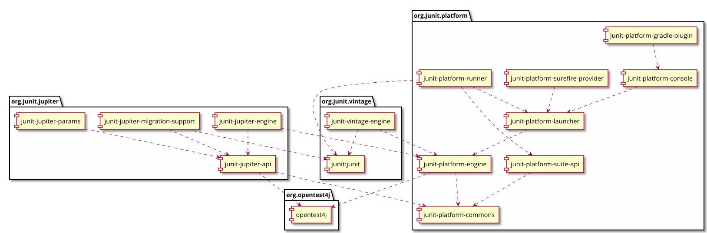

# Junit 4 vs Junit 5

## Architecture

> Junit 4

 - Monolithic : Everything is bundled into a single jar junit4.jar

> Junit 5: 

 - Platform
 
        - Internal common library/utilities of JUnit
        - Public API for test engines
        - Public API for configuring and launching test plans.
        - Runner and annotations for configuring and executing tests.
    
 - Jupiter
 
        - New junit annotations and TestEngine implementation to run tests written with these annotations.
        - Migration support from JUnit 4 to JUnit Jupiter
        
 - Vintage
 
        - support running JUnit 3 and JUnit 4 written tests on the JUnit 5 platform.
 

## Annotations

| Features | JUnit 5 | JUnit 4 |
| -------- | ----- | ------ |
| Declares a test method | @Test | @Test	
| Denotes that the annotated method will be executed before all test methods in the current class | @BeforeAll | @ BeforeClass |
| Denotes that the annotated method will be executed after all test methods in the current class | @AfterAll | @AfterClass |
| Denotes that the annotated method will be executed before each test method | @BeforeEach | @Before  |
| Denotes that  the annotated method will be executed after each test  method | @AfterEach | @After |
| Disable a test method or a test class | @Disable | @Ignore |
| Denotes a method is a test factory for dynamic tests in JUnit 5 | @TestFactory | N/A |
| Denotes that the annotated class is a nested, non-static test class | @Nested | N/A |
| Declare tags for filtering tests | @Tag | @Category |
| Register custom extensions in JUnit 5 | @ExtendWith | N/A |

## Assertions

| JUnit 5| JUnit 4 |
| -------- | ----- |
| fail | fail |
| assertTrue | assertTrue |
| N/A | assertThat |
| assertSame | assertSame |
| assertNull | assertNull |
| assertNotSame | assertNotSame |
| assertNotEquals |assertNotEquals |
| assertNotNull | assertNotNull |
| assertFalse | assertFalse |
| assertEquals |assertEquals |
| assertArrayEquals | assertArrayEquals| 
| assertAll | N/A | 
| assertThrows | N/A |
| assertTimeout | N/A |
| assertTimeoutPreemptively | N/A |

[Junit 5 Example](./junit5/src/test/java/fr/xebia/xke/assertions/AssertionsDemo.java)

[Junit 4 Example](./junit4/src/test/java/fr/xebia/assertions/AssertionsDemo.java)

## Assumptions

| JUnit 5| JUnit 4 |
| -------- | ----- |
| assumeFalse | assumeFalse |
|   |   assumeNoException | 
|   |   assumeNotNull     |
| assumeThat | assumeThat |
| assumeTrue | assumeTrue |

[Junit 5 Example](./junit5/src/test/java/fr/xebia/xke/assumptions/AssumptionsDemo.java)

[Junit 4 Example](./junit4/src/test/java/fr/xebia/assumptions/AssumptionsDemo.java)

## Tagging and Filtering

[Junit 5 Example](./junit5/src/test/java/fr/xebia/xke/tag/TaggingDemo.java)

[Junit 4 Example](./junit4/src/test/java/fr/xebia/tag/TaggingDemo.java)

## Nested Tests

[Junit 5 Example](./junit5/src/test/java/fr/xebia/xke/nested/TestingAStackDemo.java)

[Junit 4 Example](./junit4/src/test/java/fr/xebia/nested/TestingAStackDemo.java)

## Dependency Injection for Constructors and Methods

[Junit 5 Example-1](./junit5/src/test/java/fr/xebia/xke/dependencyInjection/TestInfoDemo.java)
[Junit 5 Example-2](./junit5/src/test/java/fr/xebia/xke/dependencyInjection/ReporterDemo.java)
[Junit 5 Example-3](./junit5/src/test/java/fr/xebia/xke/dependencyInjection/MyMockitoTest.java)

## Test Interfaces and Default Methods

[Junit 5 Example-1](./junit5/src/test/java/fr/xebia/xke/interfacetests/FactoryComparableTest.java)
[Junit 5 Example-2](./junit5/src/test/java/fr/xebia/xke/interfacetests/FactoryEqualsTest.java)

## Repeated Tests

[Junit 5 Example ](./junit5/src/test/java/fr/xebia/xke/repeat/RepeatedTestsDemo.java)

[Junit 4 Example](#)

## Parameterized Tests

[Junit 5 Example](./junit5/src/test/java/fr/xebia/xke/parameterized/ParameterizedTestDemo.java)

[Junit 4 Example-1](./junit4/src/test/java/fr/xebia/parameterized/FibonacciTest_Constructor.java)
[Junit 4 Example-2](./junit4/src/test/java/fr/xebia/parameterized/FibonacciTest_FieldInjection.java)
[Junit 4 Example-3](./junit4/src/test/java/fr/xebia/parameterized/ParametrizedSingleParameter.java)

## Extension Model

[Junit 5 Example ](./junit5/src/test/java/fr/xebia/xke/extension/ExtensionTestsDemo.java)

[Junit 4 Example-1](./junit4/src/test/java/fr/xebia/parameterized/ParametrizedSingleParameter.java)
[Junit 4 Example-2](./junit4/src/test/java/fr/xebia/rule/TemporaryFolderRuleTest.java)

## Migration

See @EnableRuleMigrationSupport

[Junit 5 Example ](./junit5/src/test/java/fr/xebia/xke/rule/NameRuleTest.java)
